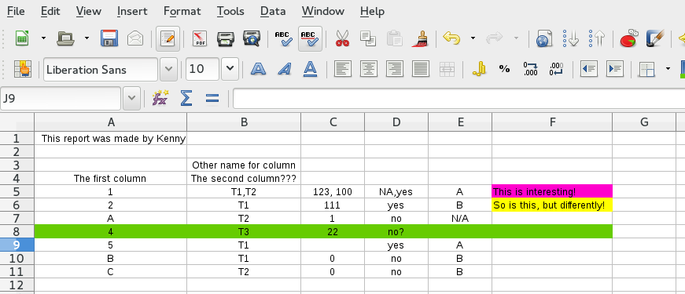

## We know where to put the data

   

## What should we put into Synapse?

What should it look like so that others can **understand it** and **(re)use it easily?**

  

## How to share data with anyone

I propose a session to discuss best practices to smooth "the transition from data collection to data analysis."

[How to share data with a statistician](https://github.com/jtleek/datasharing)

[https://github.com/jtleek/datasharing](https://github.com/jtleek/datasharing)

## Topic outline

1. The raw data.
2. A [tidy data set](http://vita.had.co.nz/papers/tidy-data.pdf) (Wickham 2014)
3. A code book describing each variable and its values in the tidy data set.
4. An explicit and exact recipe you used to go from 1 -> 2,3

https://github.com/jtleek/datasharing/

## Other parts of this course: Recipes + Synapse

## What do we want to avoid?

## What do we want to avoid?

## Teaching strategy - perfect world {.flexbox .vcenter}

I'd teach everyone

$+$ 

The Hadleyverse! (dplyr, reshape, ggplot2)

## Teaching strategy - reality

Teach `best practices` in or slightly outside the Excel comfort zone, possibly working through an example.

## Tidy data (1 to 1.5 hour(s))

Attendees should know:

1. What is an un-tidy dataset?
2. Why is a tidy dataset important?
3. What do I do to make it tidy?

## Data descriptors (0.5 to 1 hour)

Attendees should know:

1. Why should I have separate data descriptors?
2. What do I describe and how do I do it?
3. How does this connect back to the data?

## If you don't... {.flexbox .vcenter}

You get emails from the statisticians, bioinformaticians, computational biologists, analysts, collaborators, and you have to do it anyways.

---

Thank you!

